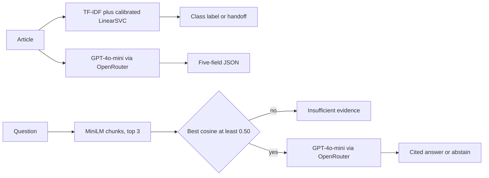

# NewsIQ

NewsIQ helps one editor sort an English article, look up the 2004-2005 BBC archive, and pull structured fields. It is a proof of concept, not a product for current news.

## Persona

Priya is a content operator. She works in English only. She does not publish automatically, fact-check, or run a legal review. When the system is unsure, she takes the item herself.

## Input and output

| Task | Input | Output |
| --- | --- | --- |
| Classify | One article | One of business, entertainment, politics, sport, tech, plus a confidence. If the top probability is below 0.90, the page does not name a desk. It tells Priya to take the article. |
| Ask the archive | One question | A short answer and the passage it came from, or the sentence "The corpus does not contain sufficient evidence." If the closest passage is below cosine 0.50, the page does not call the generator. |
| Extract | One article | JSON with people, organisations, locations, dates, and a topic of three to eight words, plus the cost of that call. |

One article or one question at a time. There is no batch of 200, and there is no review button. Before a new generator call, the page stops at 30 recorded calls or USD 0.05. A call already sent can finish past that line. Classification does not call the generator.

## Architecture



Local code fits the classifiers, builds the chunk index, applies the cutoffs, and checks JSON shape. The rented model is GPT-4o-mini at temperature 0. No agent chooses tools. The three paths are fixed.

## Metrics

Objectives come from the proposal. Results are the measured scores. Files are under `results/`.

| Metric | Objective | Result | Status |
| --- | --- | --- | --- |
| Classification weighted F1, calibrated LinearSVC | above 0.85 | 0.9798 | Met |
| Classification weighted F1, Multinomial NB | above 0.85 | 0.9499 | Met |
| Keyword baseline, abstention counts as a miss | comparison | 0.9125 | Baseline |
| Majority class, always sport | comparison | 0.086 | Baseline |
| Answer correctness on 50 frozen questions | above 0.80 | 0.74 | Not met |
| Recall at 3 on 40 grounded questions | reported, no separate objective | 0.825 | Reported |
| Extraction exact field score | above 0.75 | 0.484 | Not met |
| Entity overlap micro F1 on four list fields | not an objective | 0.8013 | Explains the exact score only |

The overlap F1 does not replace 0.484. The 0.74 score and the 0.50 cutoff are a development check on the same 50 questions, not an unseen test. Details are in `eval/EVALS.md` and `writeup/NewsIQ_tradeoff_analysis.pdf`.

## Data

The corpus is the public BBC News classification set, 2,225 articles, columns `category` and `text`, years 2004-2005. This project did not collect private user records. The articles do name public figures. The full CSV is not in git. Download it with:

```bash
python scripts/download_bbc.py
```

That writes `data/bbc-text.csv`. If the file is already there, the script checks SHA-256 `fdaee0f7451cd8db2709d00e992886fe1c387ee332b8c7b7c1554ed3d3e3382e` and does not download again. A mismatch stops without replacing the file. Read `data/DATA.md` before using the ids.

## Setup

Use Python 3.12. This repository was run with CPython 3.12.9. From the repository root:

```bash
python -m venv .venv
.venv\Scripts\python.exe -m pip install -r requirements.txt
```

On macOS or Linux, use `.venv/bin/python -m pip install -r requirements.txt`. `pip install` needs a network. The first archive search also downloads `sentence-transformers/all-MiniLM-L6-v2`.

Copy `.env.example` to `.env` and set `OPENROUTER_API_KEY` before archive answers or extraction. The key is not required to download data or to classify.

Then:

```bash
python scripts/download_bbc.py
python src/classify.py
streamlit run app.py
```

`python src/classify.py` trains the classifiers and writes `models/*.joblib`. Those weights are gitignored, so a fresh clone must retrain. That command also overwrites `results/classification.json`, `results/abstention.json`, and `results/leakage.json`.

The embedding cache in `data/embeddings/` is gitignored. If the vector files are already there, retrieval reuses them, then checks that the chunk owners match a fresh chunking of the CSV. It does not hash the CSV. If the wording changes but the chunk boundaries do not, delete `data/embeddings/` before searching again.

`results/rag.json` and `results/extraction.json` are the saved scores. `src/rag_answer.py` and `src/extract.py` keep any id already in those files and do not call the generator again for it. They spend money only for a missing id. Do not delete those files unless you intend to pay for a new run. `src/keyword_baseline.py` and `src/retrieve.py` rewrite their own result files and do not call the generator.

Do not run `scripts/make_split.py`. It rewrites the frozen split in `eval/clf_split.json`.

## Submit

Record with sound. Your face and the screen must both be visible. Aim for about 5 minutes. A video longer than 8 minutes is watched only through the first 8 minutes. Follow `writeup/demo_script.md`.

Before pushing, `git status` must not list `.env` or `data/bbc-text.csv`.

The public repository is https://github.com/ywSun04/NewsIQ.

On NTULearn, submit `writeup/NewsIQ_tradeoff_analysis.pdf`, this repository URL, and the video. The problem statement was already submitted.
