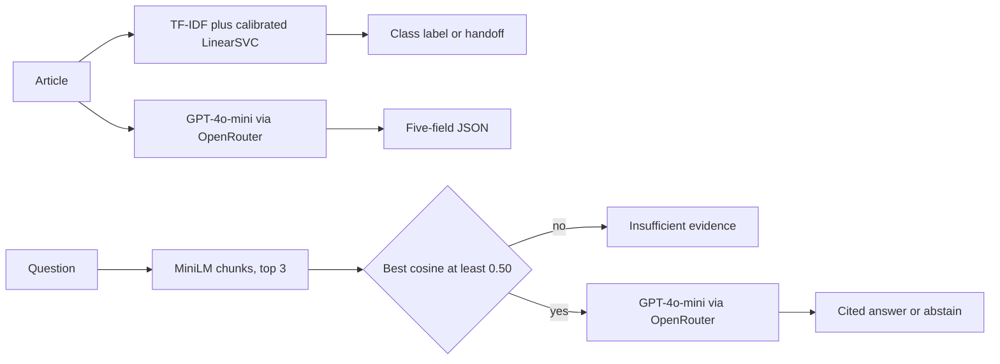

# NewsIQ

NewsIQ helps one editor sort an English article, look up the 2004-2005 BBC archive, and pull structured fields. It is a proof of concept, not a product for current news.

## Persona

Priya is a content operator. She works in English only. She does not publish automatically, fact-check, or run a legal review. When the system is unsure, she takes the item herself.

## Input and output

| Task | Input | Output |
| --- | --- | --- |
| Classify | One article | One of business, entertainment, politics, sport, tech, plus a confidence. Below the frozen threshold the page does not label it and hands it to Priya. |
| Ask the archive | One question | A short answer and the passage it came from, or the sentence "The corpus does not contain sufficient evidence." |
| Extract | One article | JSON with people, organisations, locations, dates, and a topic of three to eight words, plus the cost of that call. |

The page stops a session at 30 generator calls or USD 0.05. Classification does not call the generator.

## Architecture



Local code fits the classifiers, builds the chunk index, applies the cutoffs, and checks JSON shape. The rented model is GPT-4o-mini at temperature 0. No agent chooses tools. The three paths are fixed.

## Metrics

Objectives come from the proposal. Results are the measured scores. Files are under `results/`.

| Metric | Objective | Result | Status |
| --- | --- | --- | --- |
| Classification weighted F1, calibrated LinearSVC | above 0.85 | 0.9798 | Met |
| Classification weighted F1, Multinomial NB | above 0.85 | 0.9499 | Met |
| Keyword baseline, abstention counts as a miss | comparison | 0.9125 | Baseline |
| Majority class, always sport | comparison | 0.086 | Baseline |
| Answer correctness on 50 frozen questions | above 0.80 | 0.74 | Not met |
| Recall at 3 on 40 grounded questions | reported, no separate objective | 0.825 | Reported |
| Extraction exact field score | above 0.75 | 0.484 | Not met |
| Entity overlap micro F1 on four list fields | not an objective | 0.8013 | Explains the exact score only |

The overlap F1 does not replace 0.484. Details are in `eval/EVALS.md` and `writeup/NewsIQ_tradeoff_analysis.pdf`.

## Data

The corpus is the public BBC News classification set, 2,225 articles, columns `category` and `text`, years 2004-2005, no personal data. The full CSV is not in git. Download it with:

```bash
python scripts/download_bbc.py
```

That writes `data/bbc-text.csv`. Read `data/DATA.md` before using the ids.

## Run

```bash
python src/classify.py
streamlit run app.py
```

Copy `.env.example` to `.env` and set `OPENROUTER_API_KEY` before archive answers or extraction. The key is not required to download data or to classify. Model files in `models/` and the embedding cache in `data/embeddings/` are built on the machine that runs those commands. They are gitignored.

Saved scores are already in `results/`. Re-running `src/rag_answer.py` or `src/extract.py` calls the generator and spends money. `src/keyword_baseline.py`, `src/classify.py`, and `src/retrieve.py` do not.

## Submit

Record with sound. Your face and the screen must both be visible. Aim for about 5 minutes. A video longer than 8 minutes is watched only through the first 8 minutes. Follow `writeup/demo_script.md`.

Before pushing, `git status` must not list `.env` or `data/bbc-text.csv`.

The public repository is https://github.com/ywSun04/NewsIQ.

On NTULearn, submit `writeup/NewsIQ_tradeoff_analysis.pdf`, this repository URL, and the video. The problem statement was already submitted.
